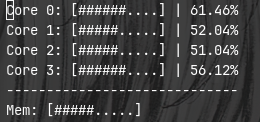

# ⚡ RustMonit

> High-performance distributed resource monitoring built with Rust & gRPC.

<p align="center">
  
</p>

<p align="center">
  <i>Minimalist CLI Interface</i>
</p>

---

## 🚀 Features

- ⚙️ Distributed monitoring architecture (Agent + Server)
- 📡 High-performance gRPC streaming communication
- 🧠 Real-time CPU & RAM metrics collection
- 🪶 Lightweight and low resource consumption
- ⚡ Fully asynchronous runtime powered by Tokio
- 🖥️ Minimalist terminal-based UI (TUI)
- 📦 Protocol Buffers for efficient serialization

---

## 🛠 Tech Stack

| Technology | Purpose |
|---|---|
| **Rust** | Systems programming & performance |
| **Tonic (gRPC)** | High-speed communication layer |
| **Tokio** | Async runtime |
| **Protocol Buffers** | Structured messaging |
| **sysinfo** | System metrics collection |

---

## ⚡ Architecture

```text
+----------------+        gRPC Stream        +----------------+
|    Agent Node  |  --------------------->  |     Server     |
|  CPU / RAM     |                           |  Metrics TUI   |
+----------------+                           +----------------+
```

---

## 📦 Quick Start

### Build Project

```bash
cargo build --release
```

### Run Server

```bash
cargo run --bin server
```

### Run Agent

```bash
cargo run --bin agent
```

---

## 🎯 Current Status

> MVP version with a console-based monitoring interface.

---

## 📄 License

MIT License © 2026
